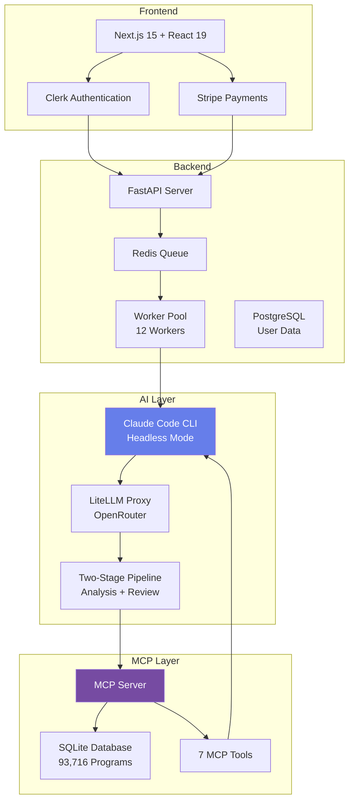

<div align="center">

# OfferI

### AI-Powered Study Abroad Consultation Platform

*Personalized master's program recommendations using Claude Code CLI and MCP*

[](https://offeri.org)
[](LICENSE)
[](https://modelcontextprotocol.io)

[Live Demo](https://offeri.org) · [Documentation](./docs) · [Issues](https://github.com/kaminoguo/OfferI_Public/issues) · [MCP Server](https://github.com/kaminoguo/OfferI_MCP)

</div>

---

## Overview

**OfferI** is an AI-powered study abroad consultation platform that provides personalized master's program recommendations from a curated database of 93,716 programs across 60+ countries.

Unlike traditional consultants charging $2,000-5,000, OfferI delivers professional analysis for $6 per consultation, with reports generated in 10-15 minutes.

### Key Metrics

- **Database Size**: 93,716 Master's programs
- **Geographic Coverage**: 60+ countries, 3,000+ universities
- **Report Generation**: 10-15 minutes
- **Pricing**: $6 per consultation (pay-per-use)
- **Quality**: 98%+ data accuracy via structured extraction

---

## Licensing Model

**This project is NOT fully open-source.** It follows an **open core** model:

### What is Available (MIT License)

- Frontend code (Next.js 15, React 19, TypeScript)
- Backend API structure (FastAPI, Python 3.11)
- MCP integration code
- Docker deployment configuration
- Documentation and setup guides

### What is Proprietary

- Database (93,716 programs - 6 months of crawling work)
- Crawler implementation code
- Internal data processing tools

**License Clarification**: This project uses **MIT License** for open-source components, NOT GPL, AGPL, or other copyleft licenses that restrict commercial use. The MIT License allows commercial use, modification, and distribution of the open-source components.

**Commercial Service**: The hosted version at [offeri.org](https://offeri.org) is a commercial service ($6 per consultation).

**Self-Hosting**: You can self-host the entire stack for free by using our [MCP API](https://github.com/kaminoguo/OfferI_MCP) (100 queries/month free tier).

---

## Product Features

### For Students

- **Comprehensive Analysis**: AI evaluates your background (GPA, school, major, projects, internships) against 93,716 programs
- **Two-Stage AI Pipeline**: Primary analysis model + Expert review model for quality assurance
- **Personalized Recommendations**: 30 tailored program suggestions (reach/match/safety schools)
- **Professional Reports**: 15-20 page PDF with detailed analysis and application strategy
- **Fast Delivery**: 10-15 minutes from submission to download
- **Privacy-Focused**: Your data is not sold to universities or third parties

### For Developers

- **Production-Ready Architecture**: Battle-tested FastAPI + Next.js stack
- **Scalable Worker Pool**: 12 concurrent workers (48 jobs/hour capacity)
- **Efficient Memory Usage**: 22MB per worker (264MB total)
- **Modern Tech Stack**: Next.js 15, React 19, FastAPI, Redis, PostgreSQL
- **Comprehensive Documentation**: Setup guides, API docs, deployment instructions

---

## MCP (Model Context Protocol) Integration

### What is MCP?

**Model Context Protocol (MCP)** is Anthropic's open standard for connecting AI models to external data sources and tools. Think of it as a universal adapter that lets Claude, GPT, or any LLM access structured databases through a standardized interface.

### Why MCP Matters

Traditional approaches use **RAG (Retrieval-Augmented Generation)** or **LangChain**:
- RAG requires vector databases, embeddings, and complex retrieval logic
- LangChain adds abstraction layers and framework overhead
- Both require significant engineering to maintain

**OfferI uses MCP instead**, which provides:
- **Direct database access** via standardized tools
- **Native LLM integration** without abstraction layers
- **Deterministic queries** (SQL) instead of vector similarity
- **Lower latency** and reduced complexity

### MCP Server (OfferI)

Our MCP server exposes 7 optimized tools:

```python
# 1. List universities by country
list_universities(country: str) -> List[str]

# 2. Search programs by university
search_programs(university_name: str) -> List[Program]

# 3. Get quick program details (7 fields - fast filtering)
get_program_details_optimized(program_ids: List[int]) -> List[ProgramSummary]

# 4. Get complete program details
get_program_details_batch(program_ids: List[int]) -> List[ProgramComplete]

# 5. Get database statistics
get_statistics() -> DatabaseStats
```

### MCP Usage Example

```python
# Claude Code CLI automatically calls MCP tools based on user query
$ claude -p "Find CS master's programs in Singapore for a 3.5 GPA student" \
  --mcp-config mcp/config.json

# MCP workflow:
# 1. list_universities("Singapore") → [NUS, NTU, SMU, SUTD]
# 2. search_programs("National University of Singapore") → [CS, AI, Data Science...]
# 3. get_program_details_batch([123, 456, 789]) → Full details for filtering
# 4. Claude analyzes and generates recommendations
```

### MCP vs Traditional Approaches

| Aspect | MCP (OfferI) | RAG | LangChain |
|--------|--------------|-----|-----------|
| **Data Access** | Direct SQL queries | Vector similarity search | Custom adapters |
| **Accuracy** | 100% (deterministic) | ~85% (semantic match) | Varies |
| **Latency** | Low (single query) | Medium (embedding + search) | High (multiple layers) |
| **Maintenance** | Standard protocol | Custom embedding pipeline | Framework updates |
| **Complexity** | Low | High | Very High |
| **Cost** | Database only | Database + Vector DB + Embeddings | All of the above |

---

## Technical Architecture

### Why No LangChain or RAG?

**OfferI deliberately avoids LangChain and RAG** for these reasons:

1. **Deterministic Queries**: Study abroad data is structured (university, program, country, tuition). SQL queries are faster and more accurate than vector similarity.

2. **No Framework Overhead**: LangChain adds abstraction layers. We use Claude Code CLI + MCP directly for cleaner, faster execution.

3. **Lower Latency**: Direct database access via MCP takes milliseconds. RAG requires embedding generation + vector search which adds seconds.

4. **Simpler Maintenance**: No vector database, no embedding models, no framework upgrades. Just SQL + MCP protocol.

5. **Cost Efficiency**: RAG requires:
   - Vector database (Pinecone/Weaviate)
   - Embedding API calls (OpenAI embeddings)
   - More LLM tokens (context stuffing)

   MCP requires:
   - SQLite database (9.6MB)
   - Direct queries (free)
   - Minimal context (only relevant data)

### Architecture Diagram



### Tech Stack

**Frontend**
- Next.js 15.5.6 (App Router)
- React 19
- TypeScript 5
- Tailwind CSS 3
- Clerk (Authentication)
- Stripe (Payments)

**Backend**
- FastAPI 0.104 (Python 3.11)
- Redis 7 (Job queue + caching)
- PostgreSQL 15 (User credits, payments)
- 12 Worker Pool (48 jobs/hour capacity)

**AI/LLM**
- Claude Code CLI (Headless mode)
- LiteLLM Proxy (OpenRouter gateway)
- Primary Model: o4-mini-deep-research
- Review Model: gpt-5-pro
- MCP (Model Context Protocol)

**Infrastructure**
- Docker + Docker Compose
- DigitalOcean (Singapore)
- Nginx (Reverse proxy)
- WeasyPrint (PDF generation)

### Data Flow

```
1. User submits background → FastAPI
2. FastAPI creates job → Redis queue
3. Worker picks job (1 of 12 concurrent workers)
4. Worker spawns Claude Code CLI in headless mode
5. Claude Code loads MCP config and tools
6. Two-stage pipeline:
   - Stage 1: Primary model searches programs via MCP tools
   - Stage 2: Review model validates and optimizes report
7. Markdown report → HTML (styled) → PDF (WeasyPrint)
8. PDF stored in Redis → User downloads
```

### Performance Characteristics

- **Worker Memory**: 22MB per worker (tested)
- **Total Worker Memory**: 264MB for 12 workers (6.6% of 4GB server)
- **Capacity**: 48 jobs/hour
- **Database Size**: 9.6MB (optimized from 53MB - 82% reduction)
- **API Cost**: ~$1.50 per report (AI tokens)
- **Report Generation**: 10-15 minutes

---

## Project Advantages

### 1. No Framework Overhead

**Traditional Approach:**
```python
# LangChain example - multiple abstraction layers
from langchain.llms import OpenAI
from langchain.agents import create_sql_agent
from langchain.sql_database import SQLDatabase

db = SQLDatabase.from_uri("sqlite:///programs.db")
agent = create_sql_agent(llm=OpenAI(), db=db, verbose=True)
# Multiple layers: LangChain → SQL Agent → OpenAI → Result parsing
```

**OfferI Approach:**
```python
# Direct Claude Code CLI + MCP - single layer
subprocess.run([
    "claude",
    "-p", user_prompt,
    "--mcp-config", "mcp/config.json"
])
# Claude Code directly calls MCP tools, no framework
```

### 2. Deterministic Database Queries

**RAG Approach:**
```
User: "Find CS programs in Singapore"
→ Generate embedding for query
→ Vector similarity search
→ Return top-k similar documents (may include irrelevant results)
→ LLM filters and summarizes
```

**MCP Approach:**
```
User: "Find CS programs in Singapore"
→ list_universities("Singapore")
→ search_programs("National University of Singapore", field="Computer Science")
→ SQL: SELECT * WHERE country='Singapore' AND field LIKE '%Computer Science%'
→ Exact matches, no false positives
```

### 3. Two-Stage Quality Pipeline

```
Stage 1: Primary Analysis (o4-mini-deep-research)
- Fast, cost-effective model
- Uses MCP tools to search 93K programs
- Filters by GPA, budget, background
- Generates initial recommendations

Stage 2: Expert Review (gpt-5-pro)
- Premium validation model
- Fact-checks recommendations
- Optimizes language and structure
- Ensures report quality

Result: Best of both worlds (speed + quality)
```

### 4. Optimized Database Schema

**Original Schema (53MB):**
- 19 fields including long text fields (description, program_structure, admission_requirements)
- Redundant tuition data (often inaccurate)

**Optimized Schema (9.6MB - 82% reduction):**
- 8 essential fields only: program_id, program_name, university_name, country_standardized, city, degree_type, study_mode, duration_months
- Removed: description, program_structure, tuition_min, tuition_max, currency (LLM searches web for latest info instead)
- Result: Faster queries, lower memory, more accurate (web search for latest tuition data)

### 5. Scalable Worker Architecture

**Problem**: Single-worker systems bottleneck at 1 job at a time

**Solution**: 12 concurrent workers
- Each worker: 22MB RAM
- Total capacity: 48 jobs/hour
- Auto-scaling: Add more workers as needed (4GB server can support 50+ workers)
- Fault tolerance: Worker crashes don't affect other jobs

### 6. Production-Ready from Day One

Unlike hobby projects that need major refactoring for production:
- Docker Compose configuration included
- Nginx reverse proxy setup
- SSL/TLS configuration
- Payment webhooks with retry logic
- User authentication with Clerk
- Comprehensive error handling
- Structured logging

---

## Quick Start

### For Users (Hosted Service)

Visit [offeri.org](https://offeri.org) and:
1. Sign in (Google/Email via Clerk)
2. Pay $6 (Stripe - all major cards accepted)
3. Fill your background (flexible format - e.g., "HKUST, GPA 3.5, CS → PM")
4. Download PDF report in 10-15 minutes

### For Developers (Self-Hosting)

**Prerequisites:**
- Docker + Docker Compose
- OpenRouter API key (for LLM access)
- Clerk account (for authentication)
- Stripe account (for payments)

**Setup:**

```bash
# Clone repository
git clone https://github.com/kaminoguo/OfferI_Public.git
cd OfferI_Public

# Option 1: Use our MCP API (recommended)
# Free tier: 100 queries/month
# See docs/SETUP_WITH_API.md

# Option 2: Build your own database
# See docs/BUILD_YOUR_OWN_DB.md
# Warning: Requires 6+ months of crawling effort

# Configure environment
cp backend/.env.example backend/.env
cp frontend/.env.example frontend/.env.local
# Edit .env files with your API keys

# Run with Docker
docker-compose up -d

# Visit http://localhost:3000
```

**Key Configuration:**

```bash
# backend/.env
OPENROUTER_API_KEY=sk-or-v1-xxxxx  # Get from openrouter.ai
CLERK_SECRET_KEY=sk_test_xxxxx     # Get from clerk.dev
STRIPE_SECRET_KEY=sk_test_xxxxx    # Get from stripe.com
NUM_WORKERS=12                      # Adjust based on server capacity
```

---

## API Reference

### REST API Endpoints

```
POST   /api/submit              Submit background for analysis
GET    /api/status/:job_id      Check job status and progress
GET    /api/results/:job_id     Download PDF report
GET    /health                  Health check and queue status

POST   /api/payment/create-session    Create Stripe checkout
POST   /api/payment/webhook           Stripe webhook handler
```

### MCP Tools

```python
# Available via MCP protocol
list_universities(country: str) -> List[str]
search_programs(university_name: str, degree_type: str = None) -> TSV
get_program_details_optimized(program_ids: List[int]) -> TSV
get_program_details_batch(program_ids: List[int]) -> List[Dict]
get_statistics() -> Dict
```

See [docs/API.md](./docs/API.md) for detailed API documentation.

---

## Database Coverage

| Region | Coverage | Notes |
|--------|----------|-------|
| North America | USA, Canada | Top universities + regional schools |
| Europe | UK, Netherlands, Germany, France, Ireland, etc. | Comprehensive coverage |
| Asia | Singapore, Hong Kong, Japan, Taiwan, South Korea | English-taught programs |
| Oceania | Australia, New Zealand | Complete coverage |
| Middle East | UAE, Qatar | English-taught programs |

**Total**: 93,716 Master's programs across 60+ countries

**Data Sources**:
- MastersPortal (StudyPortals) - Primary source
- University official websites - Asia-Pacific coverage
- JSON-LD structured extraction - 98%+ accuracy

**Update Frequency**: Quarterly (last update: October 2025)

---

## Roadmap

### Completed (v1.0 - October 2025)

- 93,716 Master's programs database
- AI recommendation engine (two-stage pipeline)
- Next.js 15 + React 19 frontend
- FastAPI backend with 12 workers
- Stripe payment integration
- PDF report generation (WeasyPrint)
- MCP server optimization (82% size reduction)
- Production deployment (Singapore server)

### Planned (v1.1 - November 2025)

- Mobile application (React Native)
- API v2 with rate limiting
- A/B testing framework (3 model configurations)
- Performance monitoring dashboard
- Email notifications for report completion

### Future (v2.0 - Q1 2026)

- Bachelor's programs (117,904 IDs extracted, ready to crawl)
- PhD programs (19,295 IDs extracted, ready to crawl)
- Multi-language support (French, Spanish, German)
- Statement of Purpose (SOP) AI writer
- Application timeline tracker
- University comparison tool

---

## Contributing

Contributions are welcome for open-source components.

### What We Accept

- Bug reports (frontend/backend issues)
- Feature suggestions (UI/UX improvements, new filters)
- Documentation improvements
- Code optimizations
- Test coverage improvements
- Translations (Chinese/English)

### What We Don't Accept

- Database modifications (proprietary)
- Crawler code changes (proprietary)
- Core business logic changes without prior discussion

### How to Contribute

```bash
# 1. Fork this repository
# 2. Create feature branch
git checkout -b feature/your-feature-name

# 3. Make changes and commit
git commit -m "Description of changes"

# 4. Push and open Pull Request
git push origin feature/your-feature-name
```

See [CONTRIBUTING.md](./CONTRIBUTING.md) for detailed guidelines.

---

## Documentation

| Document | Description |
|----------|-------------|
| [Quick Start](./docs/QUICKSTART.md) | Get running in 5 minutes |
| [Setup Guide](./docs/SETUP.md) | Self-hosting instructions |
| [API Documentation](./docs/API.md) | REST API + MCP tools reference |
| [Architecture](./docs/ARCHITECTURE.md) | System design deep-dive |
| [MCP Guide](./docs/MCP.md) | Model Context Protocol usage |
| [Deployment](./docs/DEPLOYMENT.md) | Production deployment guide |

---

## Pricing

| Plan | Price | Description |
|------|-------|-------------|
| **Free Tier** | $0 | MCP API access (100 queries/month) |
| **Pay-Per-Use** | $6 | Single consultation with PDF report |
| **API Access** | TBD | Programmatic access (planned Q1 2026) |

**Cost Breakdown (per report)**:
- AI tokens: ~$1.50
- Server costs: ~$0.50
- Margin: ~$4.00
- Total: $6.00

Traditional consultants charge $2,000-5,000 for similar analysis.

---

## License

**Open-Source Components (MIT License):**
- Frontend code (Next.js, React, TypeScript)
- Backend API (FastAPI, Python)
- MCP integration code
- Docker configuration
- Documentation

**Proprietary Components:**
- Database (93,716 programs)
- Crawler code
- Data processing tools

**Commercial Service:**
- Hosted version at offeri.org ($6 per consultation)

See [LICENSE](./LICENSE) for full MIT License text.

See [LEGAL.md](./LEGAL.md) for terms of use and data policy.

---

## Acknowledgments

**Open-Source Projects:**
- [Anthropic MCP](https://modelcontextprotocol.io) - Model Context Protocol
- [Next.js](https://nextjs.org) - React framework
- [FastAPI](https://fastapi.tiangolo.com) - Python web framework
- [Clerk](https://clerk.dev) - Authentication
- [Stripe](https://stripe.com) - Payment processing
- [WeasyPrint](https://weasyprint.org) - PDF generation
- [FlareSolverr](https://github.com/FlareSolverr/FlareSolverr) - Web scraping

**Data Sources:**
- StudyPortals - Public education data
- University official websites

**Thanks to:**
- Anthropic for Claude and MCP protocol
- OpenAI for GPT models
- All contributors and early adopters

---

## Contact

**Email**: lyrica2333@gmail.com

**GitHub Issues**: [Report bugs or request features](https://github.com/kaminoguo/OfferI_Public/issues)

**Website**: [offeri.org](https://offeri.org)

---

## Disclaimer

Information provided by OfferI is for reference purposes only and does not constitute professional study abroad consulting advice. Program details, admission requirements, and tuition fees may change. Always verify information with official university websites before making application decisions.

---

<div align="center">

**Star this repository if you find it useful**

[](https://github.com/kaminoguo/OfferI_Public)

Built for international students worldwide

</div>
