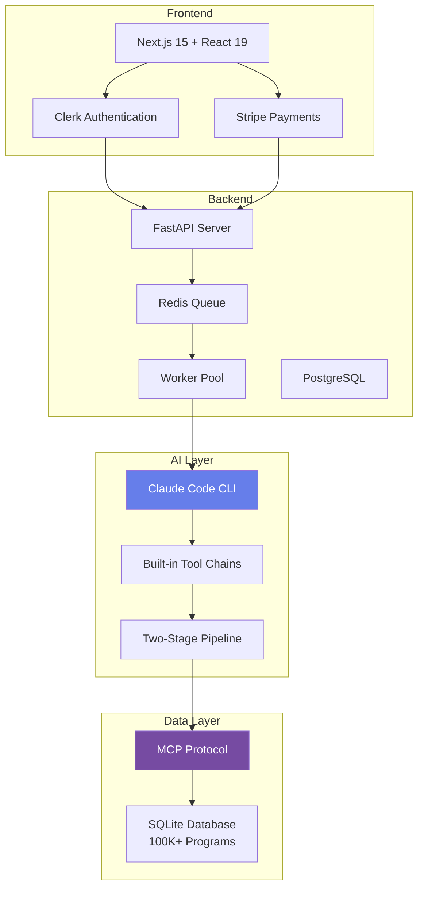

<div align="center">

# OfferI

### AI-Powered Study Abroad Consultation Platform

*Personalized master's program recommendations using Claude Code and MCP*

[](https://offeri.org)
[](LICENSE)
[](https://modelcontextprotocol.io)

[Live Demo](https://offeri.org) · [Documentation](./docs) · [Issues](https://github.com/kaminoguo/OfferI_Public/issues)

</div>

---

## Overview

**OfferI** is an AI-powered study abroad consultation platform that provides personalized master's program recommendations from a curated database of **100,000+ programs** worldwide.

Unlike traditional consultants charging $2,000-5,000, OfferI delivers professional analysis for **$6 per consultation**, with reports generated in **10-15 minutes**.

### Current Focus

**Master's Programs Only** (MVP Phase)

After validating product-market fit, we plan to expand to:
- Bachelor's programs
- PhD programs (including professor recommendations)
- Non-English taught programs

---

## Licensing Model

**This project is NOT fully open-source.** It follows an **open core** model:

### What is Available (MIT License)

- Frontend code (Next.js 15, React 19, TypeScript)
- Backend API structure (FastAPI, Python 3.11)
- MCP integration code
- Docker deployment configuration
- Documentation and setup guides

### What is Proprietary

- Database (100,000+ programs - 6 months of crawling work)
- Crawler implementation code
- Internal data processing tools

**License**: MIT License for open-source components (NOT GPL/AGPL which restrict commercial use)

**Commercial Service**: Hosted version at [offeri.org](https://offeri.org) is $6 per consultation

---

## Technical Architecture

### Why NO Vector Matching (RAG) and NO LangChain?

**We deliberately chose a different approach:**

**What We DON'T Use:**
- ❌ **Vector Matching/RAG** - Semantic similarity search with embeddings
- ❌ **LangChain** - Framework abstraction layers

**What We DO Use:**
- ✅ **MCP with Workflow** - Direct structured database queries
- ✅ **Claude Code's Built-in Tool Chains** - Native tool calling without frameworks

### Why This Approach?

| Aspect | Our Approach (MCP + Claude Code) | RAG + LangChain |
|--------|----------------------------------|-----------------|
| **Data Access** | Direct SQL queries via MCP | Vector similarity search + framework layers |
| **Accuracy** | 100% (deterministic queries) | ~85% (semantic matching) |
| **Latency** | Low (single database query) | High (embedding generation + vector search + framework) |
| **Maintenance** | MCP standard protocol | Custom embedding pipeline + framework updates |
| **Cost** | Database only | Database + Vector DB + Embeddings API + Framework |

**Study abroad data is structured** (university, program, country, tuition). SQL queries are faster and more accurate than vector similarity.

### Architecture Diagram



### Code Comparison

**LangChain Approach (What We DON'T Do):**
```python
from langchain.llms import OpenAI
from langchain.agents import create_sql_agent
from langchain.sql_database import SQLDatabase

# Multiple abstraction layers
db = SQLDatabase.from_uri("sqlite:///programs.db")
agent = create_sql_agent(llm=OpenAI(), db=db, verbose=True)
result = agent.run("Find CS programs in Singapore")
# LangChain → SQL Agent → OpenAI → Result parsing
```

**Our Approach (Claude Code + MCP):**
```python
# Direct tool calling, no framework
subprocess.run([
    "claude",
    "-p", "Find CS programs in Singapore",
    "--mcp-config", "mcp/config.json"
])
# Claude Code directly calls MCP tools → SQL queries → Results
```

---

## Tech Stack

**Frontend**
- Next.js 15 (App Router)
- React 19
- TypeScript
- Tailwind CSS
- Clerk (Authentication)
- Stripe (Payments)

**Backend**
- FastAPI (Python 3.11)
- Redis (Job queue)
- PostgreSQL (User data)
- Worker Pool (concurrent processing)

**AI/LLM**
- Claude Code CLI (Headless mode)
- MCP (Model Context Protocol)
- Two-stage pipeline (Analysis + Review)

**Infrastructure**
- Docker + Docker Compose
- DigitalOcean (Singapore)
- Nginx (Reverse proxy)
- WeasyPrint (PDF generation)

---

## Using Our MCP Server

Our MCP server is available for developers building AI applications with study abroad data.

### Quick Setup

**Step 1: Get API Key**
- Visit https://offeri.org/settings
- Create a free account and generate an API key
- Free tier: 5 MCP queries per month

**Step 2: Add to Claude Code CLI**

```bash
claude mcp add offeri https://api.offeri.org/mcp/sse \
  --transport sse \
  -e SSE_API_KEY=sk_live_YOUR_API_KEY_HERE
```

**Step 3: Add to Claude Desktop**

Edit `~/Library/Application Support/Claude/claude_desktop_config.json`:

```json
{
  "mcpServers": {
    "offeri": {
      "command": "npx",
      "args": ["-y", "@modelcontextprotocol/client-sse"],
      "env": {
        "SSE_URL": "https://api.offeri.org/mcp/sse",
        "SSE_API_KEY": "sk_live_YOUR_API_KEY_HERE"
      }
    }
  }
}
```

### Usage Example

```
You: Find computer science master's programs in Singapore
     for a student with 3.5 GPA and $50K budget

Claude: [Uses OfferI MCP to query 93,716 programs...]
        Found 12 matching programs in Singapore:
        1. NUS MSc Computer Science - $45K, 1.5 years
        2. NTU MSc AI - $42K, 1 year
        ...
```

### Available MCP Tools

- `list_universities(country)` - Get all universities in a country
- `search_programs(university)` - Search programs by university
- `get_program_details_batch([ids])` - Get detailed info for multiple programs
- `get_statistics()` - Database statistics

### Architecture

```
Your Claude Desktop/Code
    ↓ (MCP SSE Protocol)
api.offeri.org/mcp/sse
    ↓ (SQLite Database)
93,716 Master Programs
```

**No installation required** - Database hosted on our servers, always up-to-date

---

## Product Features

### For Students

- **Comprehensive Analysis**: AI evaluates your background against 100,000+ programs
- **Two-Stage AI Pipeline**: Primary analysis + Expert review for quality assurance
- **Personalized Recommendations**: 30 tailored program suggestions
- **Professional PDF Reports**: 15-20 pages with detailed analysis
- **Fast Delivery**: 10-15 minutes from submission to download
- **Privacy-Focused**: Your data is never sold to universities

### For Developers

- **Production-Ready Architecture**: Battle-tested Next.js + FastAPI stack
- **MCP Integration**: Access our program database via Model Context Protocol
- **Modern Tech Stack**: Latest Next.js 15, React 19, Python 3.11
- **Comprehensive Documentation**: Setup guides, API docs, deployment instructions

---

## Quick Start

### For Users (Hosted Service)

Visit [offeri.org](https://offeri.org):
1. Sign in (Google/Email via Clerk)
2. Pay $6 (Stripe - all major cards accepted)
3. Fill your background (flexible format)
4. Download PDF report in 10-15 minutes

### For Developers (Using MCP)

```bash
# Use our MCP server in your AI application
# See https://github.com/kaminoguo/OfferI_MCP

# Free tier: 100 queries/month
# Paid tier: Contact for API access
```

---

## Roadmap

**Current (v1.0)**
- Master's programs worldwide
- AI recommendation engine
- Web application (Next.js + FastAPI)
- Payment integration
- PDF report generation

**Planned Expansion** (after validating product-market fit)
- Bachelor's programs
- PhD programs with professor recommendations
- Non-English taught programs (French, German, Spanish, etc.)
- Mobile application
- API access for developers

---

## Pricing

| Plan | Price | Description |
|------|-------|-------------|
| **Free Tier** | $0 | MCP API access (100 queries/month) |
| **Pay-Per-Use** | $6 | Single consultation with PDF report |
| **API Access** | Contact | Programmatic access for developers |

**Cost Breakdown**: AI tokens (~$1.50) + Infrastructure (~$0.50) = $6.00

Traditional consultants charge $2,000-5,000 for similar analysis.

---

## License

**Open-Source Components (MIT License):**
- Frontend code
- Backend API
- MCP integration
- Docker configuration
- Documentation

**Proprietary Components:**
- Database (100,000+ programs)
- Crawler code
- Data processing tools

**Commercial Service:**
- Hosted version at offeri.org

See [LICENSE](./LICENSE) for full MIT License text.

---

## Documentation

| Document | Description |
|----------|-------------|
| [Architecture](./docs/ARCHITECTURE.md) | System design deep-dive |
| [MCP Guide](./docs/MCP.md) | Model Context Protocol usage |
| [Deployment](./docs/DEPLOYMENT.md) | Production deployment guide |

---

## Contact

**Email**: lyrica2333@gmail.com

**GitHub Issues**: [Report bugs or request features](https://github.com/kaminoguo/OfferI_Public/issues)

**Website**: [offeri.org](https://offeri.org)

---

## Acknowledgments

**Open-Source Projects:**
- [Anthropic MCP](https://modelcontextprotocol.io) - Model Context Protocol
- [Next.js](https://nextjs.org) - React framework
- [FastAPI](https://fastapi.tiangolo.com) - Python web framework
- [Clerk](https://clerk.dev) - Authentication
- [Stripe](https://stripe.com) - Payment processing
- [WeasyPrint](https://weasyprint.org) - PDF generation

**Data Sources:**
- StudyPortals - Public education data
- University official websites

**Thanks to:**
- Anthropic for Claude and MCP protocol
- OpenAI for GPT models
- All early adopters and supporters

---

## Disclaimer

Information provided by OfferI is for reference purposes only and does not constitute professional study abroad consulting advice. Always verify information with official university websites before making application decisions.

---

<div align="center">

**Star this repository if you find it useful**

[](https://github.com/kaminoguo/OfferI_Public)

Built for international students worldwide

</div>
